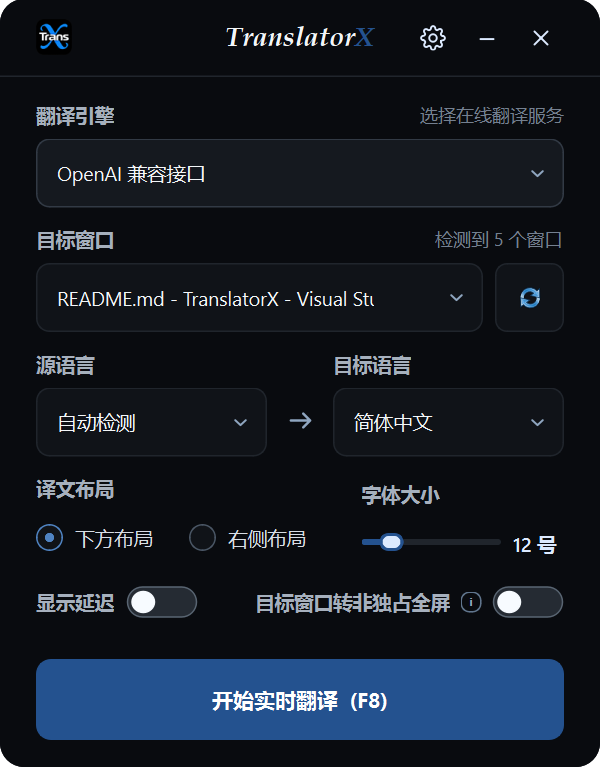
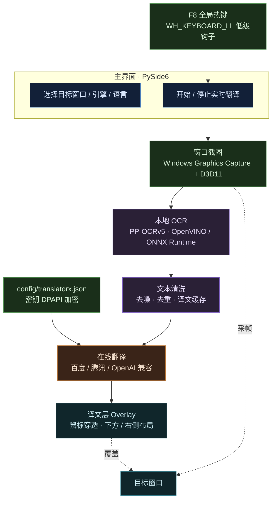

<!-- BEAUTIFIED -->
<!-- AUTO-GENERATED -->

<h1 align="center">TranslatorX</h1>
<p align="center">
  <strong>Windows 实时窗口 OCR 翻译工具：抓取目标窗口画面，识别其中文字并翻译，再把译文覆盖回原位置</strong>
  <br />
  <em>Python 3.12 · PySide6 · PP-OCRv5 · OpenVINO · Windows Graphics Capture · 鼠标穿透译文层</em>
</p>

<p align="center">
  <a href="#快速开始"></a>
</p>

<p align="center">
  
  
  
  
</p>

<p align="center">
  
  
  
  
  
</p>

<p align="center">
  
  <br />
  <sub>主界面：选择目标窗口、翻译引擎与语言，并调整译文层参数</sub>
</p>

## 功能特性

| 功能 | 说明 |
|---|---|
| 实时翻译链路 | 采帧 → OCR → 批量翻译 → 绘制译文，每 900 毫秒一轮；目标窗口不在前台时暂停截图，空 OCR 帧保留上一帧译文以减少闪烁 |
| 窗口级截图 | 通过 Windows Graphics Capture 直接读取目标窗口的 D3D11 纹理，抓帧无效时回退到 Qt 截图 |
| 本地 OCR | PP-OCRv5（`onnxocr`）在本机推理，优先 OpenVINO 加速，初始化失败自动回退 ONNX Runtime CPU |
| 四种翻译引擎 | 百度通用翻译、百度大模型翻译、腾讯云 TMT、任意 OpenAI 兼容接口（`base_url` 与模型名可自填） |
| 鼠标穿透译文层 | 译文覆盖在目标窗口上方且不拦截鼠标点击，支持原文下方与右侧两种布局，字号 9–28 可调 |
| 深色 / 浅色主题 | 两套配色共用同一套设计令牌，配置页右上角下拉切换并立即生效；两种主题的正文对比度均满足 WCAG AA |
| 桌面集成 | F8 全局热键采用低级键盘钩子（游戏独占输入时仍然生效）、系统托盘常驻、内置检查更新与一键唤起更新启动器 |

## 快速开始

### 环境要求

- Windows 10 / 11
- Python 3.12（仅源码运行需要；安装版自带运行时）

### 安装版

从 [Releases](https://github.com/baoxin1100/TranslatorX/releases) 下载 `TranslatorX-win32-release-setup.exe`（离线完整包）安装。`TranslatorX-win32-online-setup.exe` 为联网安装器。`win32` 是上游的 Windows 平台标识，不代表应用是 32 位。

### 源码运行

```powershell
python -m pip install -r requirements.txt
python run_translatorx.py
```

### 配置凭据

启动后点击标题栏的「设置」，填写所用引擎的凭据并保存。密钥经 Windows DPAPI 加密后写入本机配置文件，后续启动自动载入。

### 开始翻译

在主界面选择目标窗口、翻译引擎与语言，点击「开始实时翻译」，然后切换到目标窗口按 **F8** 开关翻译。

## 使用方法

### 界面操作

1. 在「目标窗口」下拉框选择要翻译的窗口，右侧刷新按钮可重新枚举窗口列表。
2. 选择翻译引擎、源语言与目标语言；已配置的接口可在设置页测试连通状态与延迟。
3. 独占全屏游戏无法显示译文时，勾选「目标窗口转非独占全屏」；程序会在进入时自动转换、退出时还原。
4. 通过「译文布局」「字体大小」「显示延迟」调整译文层，修改立即生效并写入配置。
5. 在设置页右上角「主题风格」下拉框切换深色 / 浅色主题，立即生效并写入配置；也可直接编辑配置文件中的 `theme`。

### 运行自检

```powershell
# OCR 运行时自检，CI 使用同一脚本
python scripts/check_ocr.py
```

### 冒烟启动

```powershell
# 启动后 2.5 秒自动关闭，用于确认界面可正常初始化
$env:TRANSLATORX_SMOKE_TEST = "1"; python run_translatorx.py
```

### 单元测试

```powershell
python -m pytest -q
```

## 架构

采集、识别、翻译与绘制运行在同一进程内：OCR 与网络请求在后台线程执行，界面线程只负责调度与绘制。



## 配置

### 文件位置

配置与日志都保存在程序目录内，不写入 `%LOCALAPPDATA%` 等其他位置。

| 运行方式 | 配置文件 | 日志目录 |
|---|---|---|
| 源码运行 | `<仓库根>/config/translatorx.json` | `<仓库根>/logs/` |
| PyAppify 安装版 | `<安装目录>/data/TranslatorX/config/translatorx.json` | `<安装目录>/data/TranslatorX/logs/` |

安装版的两个目录位于 `data/apps/<应用>` 旁边，因此既不会被更新时的文件同步清除，也不会随启动器的“删除应用”一并删除。首次运行会自动导入旧版 `TranslatorX.ini` 中的设置，旧文件保留不删。

### 配置项

配置文件为 UTF-8 JSON，可手工编辑，重启后生效。

| 键 | 说明 | 默认值 |
|---|---|---|
| `engine` | 翻译引擎：`baidu` / `baidu_llm` / `tencent` / `openai` | `baidu` |
| `source_language` | 源语言 | `auto` |
| `target_language` | 目标语言 | `zh-CN` |
| `layout_mode` | 译文布局：`below`（原文下方）/ `right`（原文右侧） | `below` |
| `overlay_font_size` | 译文基准字号，范围 9–28 | `12` |
| `show_latency` | 是否在译文层显示 OCR 与翻译耗时 | `false` |
| `auto_borderless_fullscreen` | 是否将目标窗口转为无边框全屏 | `false` |
| `theme` | 界面主题：`dark`（深色）/ `light`（浅色） | `dark` |
| `window_hwnd` / `window_title` | 上次选择的目标窗口 | — |
| `TRANSLATORX_*` | 各引擎凭据；密钥以 `_DPAPI` 后缀保存为密文 | — |

## 翻译接口

程序不对外暴露服务，仅作为这些在线翻译服务的客户端。

| 引擎 | 方法 | 端点 | 认证 |
|---|---|---|---|
| 百度通用翻译 | POST | `https://fanyi-api.baidu.com/api/trans/vip/translate` | APP ID + 密钥签名 |
| 百度大模型翻译 | POST | `https://fanyi-api.baidu.com/ait/api/aiTextTranslate` | `Authorization: Bearer <API Key>` |
| 腾讯云机器翻译 | POST | `https://tmt.tencentcloudapi.com` | TC3-HMAC-SHA256，`X-TC-Version: 2018-03-21` |
| OpenAI 兼容接口 | POST | `{base_url}/chat/completions` | `Authorization: Bearer <API Key>`，默认 `https://api.openai.com/v1` |

## 目录结构

```
translatorx/
├── ui.py               # 主窗口、标题栏、译文层协调、系统托盘、关于与更新弹窗
├── worker.py           # 后台线程：OCR 调度、文本清洗、批量翻译与缓存
├── ocr.py              # PP-OCRv5 推理封装，OpenVINO / ONNX Runtime 选择
├── wgc_capture.py      # Windows Graphics Capture + D3D11 抓帧
├── overlay.py          # 鼠标穿透译文层绘制，含 Qt 截图回退
├── windows.py          # Win32 封装：窗口枚举、DPI、Z 序、无边框全屏、F8 钩子
├── translators.py      # 百度 / 百度大模型 / 腾讯 / OpenAI 兼容翻译客户端
├── settings.py         # 设置对话框、凭据、DPAPI 加解密、接口连通性测试
├── config_store.py     # JSON 配置存储（含旧版 INI 导入）
├── paths.py            # 配置与日志路径解析
├── updater.py          # 版本检查：读取远端 tag 并与当前版本比较
├── launcher.py         # PyAppify 集成：关闭/唤起启动器、清理启动器快捷方式
├── logging_setup.py    # 日志初始化与轮转
├── theme.py            # 深色 / 浅色主题令牌与样式表生成
└── models.py           # 数据模型
assets/                 # 图标与 SVG 资源（含主界面截图）
icons/                  # 应用与安装包图标
scripts/                # OCR 自检与手动验证脚本
tests/                  # pytest 单元测试
pyappify.yml            # PyAppify 打包配置
deploy.txt              # 自动更新仓库的同步清单
requirements.txt        # 运行依赖
run_translatorx.py      # 程序入口
```

## 技术栈

### 界面

| 技术 | 用途 |
|---|---|
| PySide6 (Qt 6) | 主窗口、对话框、译文层控件与托盘 |
| Qt 样式表 + 调色板 | 由 `theme.py` 的令牌生成深色 / 浅色两套样式，SVG 图标按主题着色 |

### 识别与图像

| 技术 | 用途 |
|---|---|
| onnxocr / PP-OCRv5 | 文字检测与识别模型 |
| OpenVINO | CPU / GPU 推理加速，失败时回退 |
| ONNX Runtime | OCR 推理回退后端 |
| OpenCV | 图像解码、缩放与区域处理 |
| NumPy | 图像数组运算 |

### 系统集成

| 技术 | 用途 |
|---|---|
| Windows Graphics Capture | 窗口级抓帧（D3D11） |
| Win32 API (ctypes) | 窗口枚举、DPI 感知、Z 序、无边框全屏、全局热键 |
| Windows DPAPI | 本机凭据加解密 |

### 打包与更新

| 技术 | 用途 |
|---|---|
| PyAppify | 打包安装包、管理 Python 环境与依赖、按 Git tag 更新 |
| GitHub Actions | 打 tag 后自动测试、打包并发布 Release |

## 部署

### 发布流程

推送 `v*` tag 会自动运行 `.github/workflows/release.yml`：在独立环境安装依赖、执行单元测试、运行真实 OpenVINO OCR 检查、使用 PyAppify 打包在线与离线安装包，并上传 GitHub Release。Actions 页面也可手动运行，此时只上传构建产物，不发布 Release。

```powershell
git add .
git commit -m "Release changes"
git push origin main
git tag v1.0.12
git push origin v1.0.12
```

版本使用递增语义版本，测试版本使用 `v0.1.1-beta.1` 形式并标记为预发布。每次发布应先等待测试通过再创建 tag；PyAppify 按 Git tag 检查更新，不会等待 Release 安装包构建完成。已经发布的 tag 请勿覆盖。

### 更新机制

安装版由 PyAppify 启动器负责更新。程序「关于」对话框可检查远端版本并一键打开启动器；升级时会同步 `deploy.txt` 列出的内容到更新仓库，用户端只下载增量部分。

Release 附带 PyAppify 的 GPL 许可证、对应上游源码、品牌修改补丁与 SHA-256 校验表。

### 快捷方式

安装后桌面与开始菜单只保留主程序快捷方式；启动器快捷方式会在程序启动后被自动清理，需要更新时由「关于」对话框唤起启动器。

## 贡献

1. Fork 仓库并创建分支（`git checkout -b feature/your-feature`）
2. 推送分支（`git push origin feature/your-feature`）
3. 发起 Pull Request，说明改动动机与验证方式

提交前请先通过单元测试与 OCR 自检：

```powershell
python -m pytest -q
python scripts/check_ocr.py
```

## 许可证

未检测到 LICENSE 文件。建议补充一个 LICENSE 以明确本项目的授权方式。

> No LICENSE file detected. Add a LICENSE to clarify project licensing.
